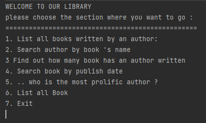

#Java excercise 4 

- to run the project, please execure this command in your terminal where the root project is :
+ install project : mvn install 
+ execute the project : mvn exec:java -D"exec.mainClass"="Main"

+ Library guidance : this is the menu of the library

you can use all these 6 function to explore our library and press 7 if you want to exit. 

Have fun exploring our library and remember, keep calm and read books!